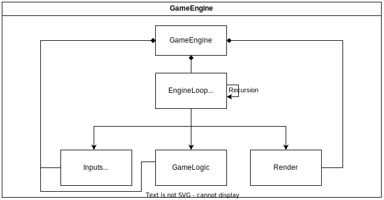
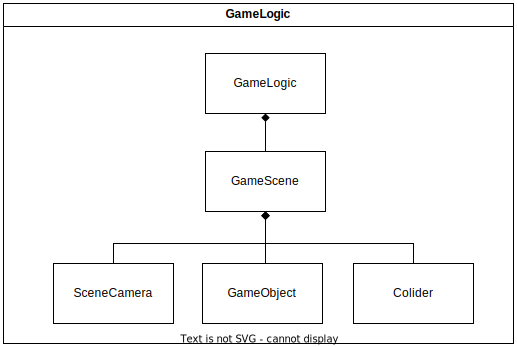
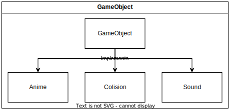

# Invader Engine

É uma *game engine* feito para simplificar o desenvolvimento de games usando *Typescript* no Browser. Traz simplificações das entradas dos dados, renderização, colisão, sessão onde colocar a lógica do jogo, e o loop de controle destes módulos.

## Principais Módulos

### 1 - GameEngine

A **GameEngine** irá conter as informações do jogo como a resolução do jogo, terá acesso todos os os outros módulos de controle dos dados, como:

- **Inputs** - Controlando todos os tipos de entrada para a engine, como keyboard, mouse, microfone, webcam, etc...
- **GameLogic** - Contém toda a lógica e estados do jogo, todas as cenas.
- **Render** - Renderiza a cena atual do game que foi passada pelo **GameLogic**.

### 2 - GameLogic

O **GameLogic** irá conter toda a lógica do jogo e seus estados, as cenas.

- **GameScene** - Contém todos os **GameObjects** da cena, a câmera da cena, e o colisor.
  - **SceneCamera** - Ela terá a responsabilidade de identificar quais dos **GameObjects** estão sendo vistos pela câmera, para que o **Render** renderize apenas o necessário.
  - **GameObject** - É a classe que serve como base para a criação dos objetos do jogo, como: Uma árvore, NPC, Player ... Ele pode conter colisão, animação, sons, sprites.
  - **Colider** - Ele controlará todos os **GameObjects** que tenham implementado a interface **Colision**. O **Colider** só receberá os

#### 2.2 - GameObject

O **GameObject** será uma classe independente que implementa outras interfaces. Ela terá acesso apenas a ela mesma, sabendo assim, apenas de sí mesma.

Ela terá seus próprios estados, saberá suas animações, posição dentro do plano cartesiano, saberá quais sons emitir.

Mas ela será uma classe abstrata, ou seja, ela será sempre usada como uma extensão para uma outra classe relacionada ao jogo, como um NPC e/ou o Player. 

Interfaces para implementação do **GameObject**:

- **Anime** - Interface que contém as propriedades e métodos para a implementação das animações.
- **Colision** - Interface que contém as propriedades e métodos para a implementação das colisões.
- **Sound** - Interface que contém as propriedades e métodos para a implementação dos sons.

